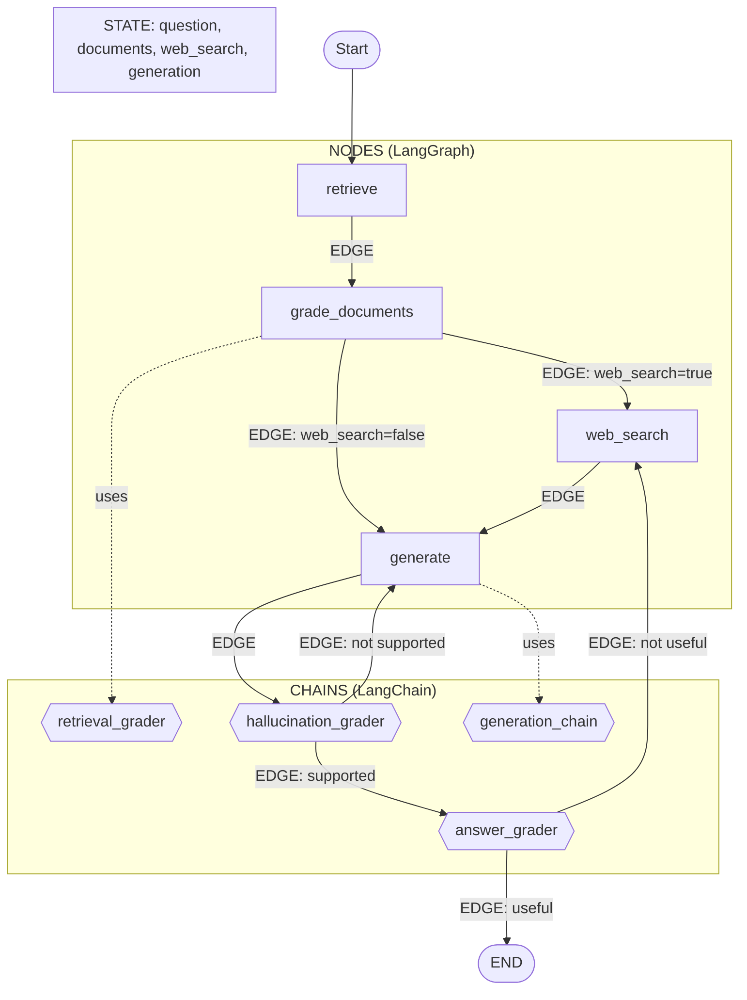

```mermaid
flowchart TD
  subgraph STATE["STATE: question, documents, web_search, generation"]
    direction LR
  end

  START([Start]) --> R

  subgraph NODES["NODES (LangGraph)"]
    R[retrieve]
    GD[grade_documents]
    WS[web_search]
    G[generate]
  end

  subgraph CHAINS["CHAINS (LangChain)"]
    RG{{retrieval_grader}}
    HG{{hallucination_grader}}
    AG{{answer_grader}}
    GC{{generation_chain}}
  end

  R -->|EDGE| GD
  GD -.->|uses| RG
  GD -->|"EDGE: web_search=true"| WS
  GD -->|"EDGE: web_search=false"| G
  WS -->|EDGE| G
  G -.->|uses| GC
  G -->|EDGE| HG
  HG -->|"EDGE: not supported"| G
  HG -->|"EDGE: supported"| AG
  AG -->|"EDGE: useful"| END([END])
  AG -->|"EDGE: not useful"| WS
```